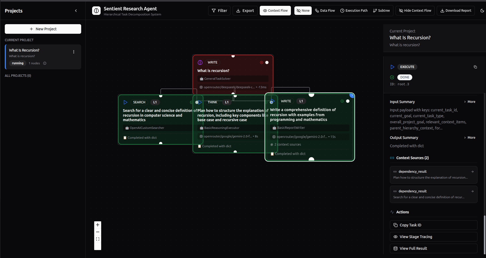

# ROMA Quick Start Guide

Undoubtedly, **ROMA** https://github.com/sentient-agi/ROMA is a very powerful product with a wide range of features.  
However, this guide is intended only for **basic familiarization**, so it will not cover all capabilities.  
Here you will find the simplest way to install and interact with ROMA via the API.

**This guide is not intended to be the definitive manual. Its purpose is only to demonstrate the general principle of how it works. Before deploying the service to production, make sure to study the system on your own or refer to the official documentation from the developer.**

---

## Step 1. Install ROMA

In this example, we will install ROMA using **Docker**.

```bash
git clone https://github.com/sentient-agi/ROMA.git
cd ROMA

./setup.sh --docker
```

Or, alternatively:

```bash
git clone https://github.com/sentient-agi/ROMA.git
cd ROMA
cp .env.example .env
cd docker

docker compose up -d
```

## Step 2. Configure the Environment
Go back to the ROMA root folder and open the .env file.
Add your API keys for the supported services (not all are required).
For example, you can set only OPENROUTER_API_KEY and EXA_API_KEY.

.env file
```bash
# SentientResearchAgent Environment Configuration
# Copy this file to .env and fill in your API keys

# ===== LLM Provider Keys =====
# OpenRouter API key (primary LLM provider)
OPENROUTER_API_KEY=openrouter_api_key

# OpenAI API key (optional - for direct OpenAI usage)
OPENAI_API_KEY=your_openai_key_here

# Google GenAI API key (optional - for Gemini models)
GOOGLE_GENAI_API_KEY=your_google_genai_key_here

# Anthropic API key (optional - for Claude models)
ANTHROPIC_API_KEY=your_anthropic_key_here
..............................
```

Open the .sentient.yaml file and update the configuration:

```bash
llm:
  provider: "openrouter"
  api_key: "${OPENROUTER_API_KEY}"
```
⚠️ Important Note
By default, ROMA uses paid models and processes requests quite aggressively, which may quickly spend your credits on services such as OpenRouter.

While testing, it is recommended to switch all agents to free models.
To do this, edit the following file:
ROMA/src/sentientresearchagent/hierarchical_agent_framework/agent_configs/agents.yaml
Example configuration:

```bash
- name: "CoreResearchPlanner"
  type: "planner"
  adapter_class: "PlannerAdapter"
  description: "Specialized planner for research-focused tasks"
  model:
    provider: "litellm"
    model_id: "openrouter/deepseek/deepseek-chat-v3.1:free"
```
⚠️ Note: In the free models, some limitations apply.

## Step 3. Restart Docker with New Settings
After applying the changes, restart the containers:

```bash
cd docker

docker compose -f docker-compose.yml down
docker compose -f docker-compose.yml up -d
```

So, after installing and running the Docker container, we have two types of services available. The frontend, where we can interact with ROMA through the web interface at http://localhost:3000, and the backend, the system we will interact with directly via the API at http://localhost:5000

You can make API requests using any method that is convenient for you—Curl, custom scripts, or Postman.
So, to begin, we register our request by creating a project. In the request, we will send the query prompt (goal) and the settings.

Our request:
```bash
{
    "goal": "What is recursion?",
    "config": {
        "profile": {
            "name": "general_agent",
            "displayName": "General Agent"
        },
        "llm": {
            "provider": "litellm",
            "model": "openrouter/deepseek/deepseek-chat-v3.1:free",
            "temperature": 0.0,
            "timeout": 30,
            "max_retries": 3
        },
        "execution": {
            "force_root_node_planning": false,
            "rate_limit_rpm": 5,
            "skip_atomization": true,
            "max_concurrent_nodes": 6,
            "max_execution_steps": 3,
            "max_recursion_depth": 1,
            "task_timeout_seconds": 100,
            "enable_hitl": false,
            "hitl_root_plan_only": false,
            "hitl_timeout_seconds": 300,
            "hitl_after_plan_generation": false,
            "hitl_after_modified_plan": false,
            "hitl_after_atomizer": false,
            "hitl_before_execute": false,
            "state_batch_size": 5,
            "ws_batch_size": 5
        },
        "cache": {
            "enabled": true,
            "ttl_seconds": 3600,
            "max_size": 500,
            "cache_type": "memory"
        },
        "project": {
            "goal": "What is recursion?",
            "max_steps": 3
        }
    },
    "max_steps": 3
}
```
We send this request to the endpoint http://localhost:5000/api/projects/configured using the POST method with content-type: application/json.

Response from ROMA:
```bash
{
    "config_applied": true,
    "message": "Configured project created and started",
    "project": {
        "completion_percentage": 0.0,
        "created_at": "2025-09-13T11:03:22.657712",
        "description": "What is recursion?",
        "error": null,
        "goal": "What is recursion?",
        "id": "1da38986-b637-4da3-9dcd-ee26ff65c5ec",
        "max_steps": 3,
        "node_count": 0,
        "status": "active",
        "title": "What Is Recursion?",
        "updated_at": "2025-09-13T11:03:22.657714"
    }
}
```
In the field "id": "1da38986-b637-4da3-9dcd-ee26ff65c5ec", we received the identifier of our created project. 
To get the answer to our question, we send a GET request to the endpoint http://localhost:5000/api/projects/<project_id>/load-results, where instead of <project_id> we insert the received identifier. In my case, the request looks like this: http://localhost:5000/api/projects/1da38986-b637-4da3-9dcd-ee26ff65c5ec/load-results

Response from ROMA:
```bash
{
    "basic_state": {
        "all_nodes": {
            "root": {
                "agent_name": "GeneralTaskSolver",
                "error": null,
                "execution_details": {
                    "final_llm_input": "Current Task Goal: What is recursion?\n\nContext:\nNo relevant context was provided.",
                    "model_info": {
                        "adapter_name": "GeneralTaskSolver",
                        "model_id": "openrouter/deepseek/deepseek-chat-v3.1:free",
                        "model_name": "deepseek/deepseek-chat-v3.1:free",
                        "model_provider": "openrouter"
                    },
                    "success": true
                },
                "full_result": null,
                "goal": "What is recursion?",
                "layer": 0,
                "model_display": "openrouter/deepseek/deepseek-chat-v3.1:free",
                "model_info": {
                    "adapter_name": "GeneralTaskSolver",
                    "model_id": "openrouter/deepseek/deepseek-chat-v3.1:free",
                    "model_name": "deepseek/deepseek-chat-v3.1:free",
                    "model_provider": "openrouter"
                },
                "node_type": "PLAN",
                "output_summary": null,
                "overall_objective": "What is recursion?",
                "status": "RUNNING",
                "task_id": "root",
                "task_type": "WRITE"
            },
            "root.1": {
                "agent_name": "OpenAICustomSearcher",
                "aux_data": {
                    "depends_on_indices": [],
                    "full_result": {
                        "output_text": "API Call Failed: Error code: 429 - {'error': {'message': 'Rate limit exceeded: free-models-per-day. Add 10 credits to unlock 1000 free model requests per day', 'code': 429, 'metadata': {'headers': {'X-RateLimit-Limit': '50', 'X-RateLimit-Remaining': '0', 'X-RateLimit-Reset': '1757808000000'}, 'provider_name': None}}, 'user_id': 'user_32bpAITOWp2jYj8hno0RZ86AddP'}",
                        "query_used": "Search for a clear and concise definition of recursion in computer science and mathematics"
                    }
                },
                "error": null,
                "execution_details": null,
                "full_result": {
                    "output_text": "API Call Failed: Error code: 429 - {'error': {'message': 'Rate limit exceeded: free-models-per-day. Add 10 credits to unlock 1000 free model requests per day', 'code': 429, 'metadata': {'headers': {'X-RateLimit-Limit': '50', 'X-RateLimit-Remaining': '0', 'X-RateLimit-Reset': '1757808000000'}, 'provider_name': None}}, 'user_id': 'user_32bpAITOWp2jYj8hno0RZ86AddP'}",
                    "query_used": "Search for a clear and concise definition of recursion in computer science and mathematics"
                },
                "goal": "Search for a clear and concise definition of recursion in computer science and mathematics",
                "input_context_sources": [],
                "input_payload_summary": "Input payload with keys: current_task_id, current_goal, current_task_type, overall_project_goal, relevant_context_items, parent_hierarchy_context, formatted_full_context",
                "layer": 1,
                "model_display": "Not processed",
                "model_info": null,
                "node_type": "EXECUTE",
                "output_summary": "Completed with dict",
                "overall_objective": "What is recursion?",
                "parent_node_id": "root",
                "status": "DONE",
                "task_id": "root.1",
                "task_type": "SEARCH"
            },
            "root.2": {
                "agent_name": "BasicReasoningExecutor",
                "aux_data": {
                    "execution_details": {
                        "final_llm_input": "Current Task Goal: Plan how to structure the explanation of recursion, including key components like base case and recursive case\n\nContext:\nNo relevant context was provided.",
                        "model_info": {
                            "adapter_name": "BasicReasoningExecutor",
                            "model_id": "openrouter/google/gemini-2.0-flash-exp:free",
                            "model_name": "google/gemini-2.0-flash-exp:free",
                            "model_provider": "openrouter"
                        },
                        "success": true
                    }
                },
                "error": null,
                "execution_details": {
                    "final_llm_input": "Current Task Goal: Plan how to structure the explanation of recursion, including key components like base case and recursive case\n\nContext:\nNo relevant context was provided.",
                    "model_info": {
                        "adapter_name": "BasicReasoningExecutor",
                        "model_id": "openrouter/google/gemini-2.0-flash-exp:free",
                        "model_name": "google/gemini-2.0-flash-exp:free",
                        "model_provider": "openrouter"
                    },
                    "success": true
                },
                "goal": "Plan how to structure the explanation of recursion, including key components like base case and recursive case",
                "input_payload_summary": "Input payload with keys: current_task_id, current_goal, current_task_type, overall_project_goal, relevant_context_items, parent_hierarchy_context, formatted_full_context",
                "layer": 1,
                "model_display": "openrouter/google/gemini-2.0-flash-exp:free",
                "model_info": {
                    "adapter_name": "BasicReasoningExecutor",
                    "model_id": "openrouter/google/gemini-2.0-flash-exp:free",
                    "model_name": "google/gemini-2.0-flash-exp:free",
                    "model_provider": "openrouter"
                },
                "node_type": "EXECUTE",
                "output_summary": "Completed with dict",
                "overall_objective": "What is recursion?",
                "parent_node_id": "root",
                "status": "DONE",
                "task_id": "root.2",
                "task_type": "THINK"
            },
            "root.3": {
                "agent_name": "BasicReportWriter",
                "aux_data": {
                    "execution_details": {
                        "model_info": {
                            "adapter_name": "BasicReportWriter",
                            "model_id": "openrouter/google/gemini-2.0-flash-exp:free",
                            "model_name": "google/gemini-2.0-flash-exp:free",
                            "model_provider": "openrouter"
                        },
                        "success": true
                    },
                    "full_result": {
                        "output_text": "Recursion is a programming technique where a function calls itself to solve smaller subproblems of the same type (Task ID: root.2). The explanation of recursion includes key components like the base case and recursive case (Task ID: root.2).\n\nThe base case is the condition that stops the recursion (Task ID: root.2). Without a base case, the function would call itself indefinitely, leading to a stack overflow error (Task ID: root.2). Examples of base cases include reaching 0 in a factorial function or finding an empty list in a list processing function (Task ID: root.2).\n\nThe recursive case is the part of the function where it calls itself with a modified input (Task ID: root.2). The modified input should move the problem closer to the base case (Task ID: root.2). The recursive call breaks down the problem into smaller, self-similar subproblems (Task ID: root.2).\n\nRecursive calls are managed on the call stack (Task ID: root.2). Each recursive call adds a new frame to the stack, and the base case triggers the unwinding of the stack (Task ID: root.2).\n\nClassic examples of recursion include factorial calculation, Fibonacci sequence, tree traversal, and binary search (Task ID: root.2).\n\nAdvantages of recursion include elegance, code conciseness, and suitability for certain problems (Task ID: root.2). Disadvantages include potential stack overflow errors, overhead of function calls, and difficulty in debugging (Task ID: root.2).\n\nTail recursion, where the recursive call is the last operation in the function, can be optimized by compilers to avoid stack overflow errors (Task ID: root.2). Recursion can also be compared with iteration (loops), and each approach is more appropriate for different scenarios (Task ID: root.2). A recursive function can be converted into an iterative one and vice versa (Task ID: root.2).",
                        "query_used": "Write a comprehensive definition of recursion with examples from programming and mathematics"
                    }
                },
                "error": null,
                "execution_details": {
                    "model_info": {
                        "adapter_name": "BasicReportWriter",
                        "model_id": "openrouter/google/gemini-2.0-flash-exp:free",
                        "model_name": "google/gemini-2.0-flash-exp:free",
                        "model_provider": "openrouter"
                    },
                    "success": true
                },
                "full_result": {
                    "output_text": "Recursion is a programming technique where a function calls itself to solve smaller subproblems of the same type (Task ID: root.2). The explanation of recursion includes key components like the base case and recursive case (Task ID: root.2).\n\nThe base case is the condition that stops the recursion (Task ID: root.2). Without a base case, the function would call itself indefinitely, leading to a stack overflow error (Task ID: root.2). Examples of base cases include reaching 0 in a factorial function or finding an empty list in a list processing function (Task ID: root.2).\n\nThe recursive case is the part of the function where it calls itself with a modified input (Task ID: root.2). The modified input should move the problem closer to the base case (Task ID: root.2). The recursive call breaks down the problem into smaller, self-similar subproblems (Task ID: root.2).\n\nRecursive calls are managed on the call stack (Task ID: root.2). Each recursive call adds a new frame to the stack, and the base case triggers the unwinding of the stack (Task ID: root.2).\n\nClassic examples of recursion include factorial calculation, Fibonacci sequence, tree traversal, and binary search (Task ID: root.2).\n\nAdvantages of recursion include elegance, code conciseness, and suitability for certain problems (Task ID: root.2). Disadvantages include potential stack overflow errors, overhead of function calls, and difficulty in debugging (Task ID: root.2).\n\nTail recursion, where the recursive call is the last operation in the function, can be optimized by compilers to avoid stack overflow errors (Task ID: root.2). Recursion can also be compared with iteration (loops), and each approach is more appropriate for different scenarios (Task ID: root.2). A recursive function can be converted into an iterative one and vice versa (Task ID: root.2).",
                    "query_used": "Write a comprehensive definition of recursion with examples from programming and mathematics"
                },
                "goal": "Write a comprehensive definition of recursion with examples from programming and mathematics",
                "input_context_sources": [
                    {
                        "content_type": "dependency_result",
                        "source_task_goal_summary": "Plan how to structure the explanation of recursion...",
                        "source_task_id": "root.2"
                    },
                    {
                        "content_type": "dependency_result",
                        "source_task_goal_summary": "Search for a clear and concise definition of recur...",
                        "source_task_id": "root.1"
                    }
                ],
                "input_payload_summary": "Input payload with keys: current_task_id, current_goal, current_task_type, overall_project_goal, relevant_context_items, parent_hierarchy_context, formatted_full_context",
                "layer": 1,
                "model_display": "openrouter/google/gemini-2.0-flash-exp:free",
                "model_info": {
                    "adapter_name": "BasicReportWriter",
                    "model_id": "openrouter/google/gemini-2.0-flash-exp:free",
                    "model_name": "google/gemini-2.0-flash-exp:free",
                    "model_provider": "openrouter"
                },
                "node_type": "EXECUTE",
                "output_summary": "Completed with dict",
                "overall_objective": "What is recursion?",
                "parent_node_id": "root",
                "status": "DONE",
                "task_id": "root.3",
                "task_type": "WRITE"
            }
        }
}
```

I didn’t include the full JSON since it turned out to be quite large. As we can see, in root.1 I exceeded the limit, because the models in the settings are free, so I got an error with the message: Rate limit exceeded. root.2 worked and created a plan. And root.3 was able to get a response from the model, and we received the answer to our question.
```bash
"root.3": {
    "full_result": {
        "output_text": "Recursion is a programming technique where a function calls itself to solve smaller subproblems of the same type (Task ID: root.2). The explanation of recursion includes key components like the base case and recursive case (Task ID: root.2).\n\nThe base case is the condition that stops the recursion (Task ID: root.2). Without a base case, the function would call itself indefinitely, leading to a stack overflow error (Task ID: root.2). Examples of base cases include reaching 0 in a factorial function or finding an empty list in a list processing function (Task ID: root.2).\n\nThe recursive case is the part of the function where it calls itself with a modified input (Task ID: root.2). The modified input should move the problem closer to the base case (Task ID: root.2). The recursive call breaks down the problem into smaller, self-similar subproblems (Task ID: root.2).\n\nRecursive calls are managed on the call stack (Task ID: root.2). Each recursive call adds a new frame to the stack, and the base case triggers the unwinding of the stack (Task ID: root.2).\n\nClassic examples of recursion include factorial calculation, Fibonacci sequence, tree traversal, and binary search (Task ID: root.2).\n\nAdvantages of recursion include elegance, code conciseness, and suitability for certain problems (Task ID: root.2). Disadvantages include potential stack overflow errors, overhead of function calls, and difficulty in debugging (Task ID: root.2).\n\nTail recursion, where the recursive call is the last operation in the function, can be optimized by compilers to avoid stack overflow errors (Task ID: root.2). Recursion can also be compared with iteration (loops), and each approach is more appropriate for different scenarios (Task ID: root.2). A recursive function can be converted into an iterative one and vice versa (Task ID: root.2).",
        "query_used": "Write a comprehensive definition of recursion with examples from programming and mathematics"
    }
}
```
Thanks to the fact that we registered the project, we can also view it in the web interface at http://localhost:3000/


That’s it. I tried to share a small guide on how to send an API request in sentient-agi/ROMA. If there are any mistakes in the article or if you have any suggestions, please feel free to share them.
